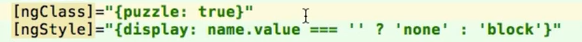
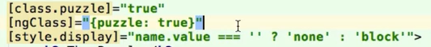

# Angular 2 udemy course

- setup boilerplate project at 
y:\Udemy\Angular2\01 Course Introduction\006 Setting up the Development Environment.mp4
- [boilerplate source](https://github.com/mschwarzmueller/angular-2-beta-boilerplate)

## 009 First Project - Puzzle App Part 1.mp4

- explain scss
- read  about scss @ [getting-started-with-sass](https://scotch.io/tutorials/getting-started-with-sass)

## 010 First Project - Puzzle App Part 2.mp4

- Use 
- Instead 

# completed
y:\Udemy\Angular2\02 Components  Templates\