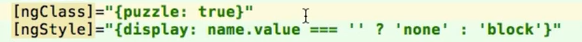
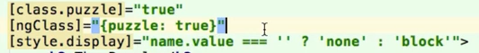

# Angular 2 udemy course

## 01 Course Introduction

### 006 Setting up the Development Environment.mp4

- install nodejs v6.3.0  from https://nodejs.org/en/
- go to https://www.npmjs.com/  (click on documentation https://docs.npmjs.com/) and select `02 - Installing Node.js and updating npm`
- in terminal window run `npm -v` confirm output 3.10.3
- in terminal window run `npm install npm -g`
- `npm -v` again confirm output 3.10.5 (means npm had been updated)
- _skipped_ Go to www.typescriptlang.org to install typescript tools by `npm install typescript -g` 
- in terminal window run C:\WebStormWS\AngularBook\angular2DataBinding>npm install
- this will install `\node_modules` with all mentioned in `package.json`

- setup boilerplate project at 
y:\Udemy\Angular2\01 Course Introduction\006 Setting up the Development Environment.mp4
- [boilerplate source](https://github.com/mschwarzmueller/angular-2-beta-boilerplate)

## 009 First Project - Puzzle App Part 1.mp4

- explain scss
- read  about scss @ [getting-started-with-sass](https://scotch.io/tutorials/getting-started-with-sass)

## 010 First Project - Puzzle App Part 2.mp4

- Use angular class and style 
- Instead of shortcuts 

## 03 Databinding

### 002 String Interpolation.mp4

### 003 Property Binding.mp4

- instead `<input type="text" value="{{name}}">`
- use `<input type="text" [value]="name">`
